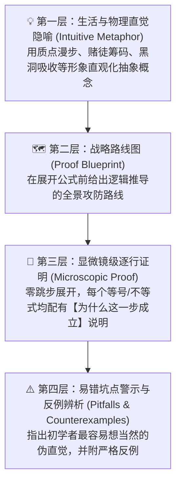

# 离散时间马尔科夫链 · 全景可视化讲义与显微镜证明工作台
> **基于南京大学数学系 戴雄平教授《应用随机过程》（Lectures on Stochastic Processes）第一章 Discrete-Time Markov Chains (pp. 35 - 76)**
> **面向初学者（直观降维）与高阶数学研究者的交互式可视化学习系统**

---

## 🌟 平台设计理念与核心特色

本工作台针对传统随机过程教材中**“定理孤立难记”、“证明跳步严重”、“缺乏物理直觉”**三大痛点，采用**四层递进式教学协议**进行重构：



---

## 📁 目录与模块架构

```
应用随机过程/
├── index.html              # 主交互页面（单页应用，双击直接在任意浏览器打开）
├── data/
│   ├── section1_1.js       # §1.1 基础概念、C-K方程、互通与周期性 (17个知识节点)
│   ├── section1_2.js       # §1.2 常返与非常返、第一击中时间、1D/2D/3D游走 (17个知识节点)
│   ├── section1_3.js       # §1.3 正常返与零常返、更新极限定理、循环分解 (14个知识节点)
│   ├── section1_4.js       # §1.4 吸收概率、生存调和方程、赌徒破产通解 (7个知识节点)
│   ├── section1_5.js       # §1.5 实用判据、Foster漂移理论、M/D/1排队论 (16个知识节点)
│   └── index.js            # 数据中枢与拓扑因果关系网络构建 (71个节点, 121条因果边)
├── js/
│   ├── graph.js            # 拓扑知识图谱 Canvas 渲染与高亮引擎 (支持平移、缩放、依赖高光)
│   ├── simulations.js      # 四大动态蒙特卡洛仿真沙盒引擎 (1D/2D/3D游走、赌徒破产、Tom&Jerry、排队论)
│   └── app.js              # 视图路由切换、显微镜步进器控制器、全局检索过滤
└── README.md               # 讲义精要与平台指南文档
```

---

## 🚀 核心功能速览

### 1. 🌐 全局拓扑知识星系 (Topological Mind Graph)
- **五大章节色带分区**：清晰辨识从“基础分类”到“常返性判定”再到“遍历极限定理”和“Foster判据”的递进逻辑。
- **因果高光追踪**：
  - 点击任何一个节点（例如 **定理 1.2.1 常返性级数判据**），系统以**橙色连线**追溯其前置引理（如引理 1.2.5 首次回访概率为1、引理 1.2.7 级数恒等式、Borel-Cantelli 引理）。
  - 以**绿色连线**高亮其后继解锁引申（如命题 1.2.9 常返是类性质、定理 1.2.11 戴雄平定理、定理 1.3.3 基础极限定理）。

### 2. 🔬 显微镜级逐行证明步进器 (Microscopic Proof Stepper)
- 收录全章 **71 个核心定理、引理、命题与习题** 的完全推导。
- 绝无“显然成立”或“同理可证”。每一个公式均标明使用的分析工具（如：*Lebesgue 控制收敛定理*、*Levi 单调收敛定理*、*Fatou 引理*、*Tonelli 交换求和定理*、*Vandermonde 卷积恒等式* 等）。

### 3. 🎲 蒙特卡洛动态模拟实验室 (Interactive Simulation Sandboxes)
1. **Pólya 随机游走维度诅咒实验台 (1D vs 2D vs 3D)**：
   - 实时三维等轴测投影与二维网格轨迹跟踪。
   - 直观验证为什么 1D/2D 无论走多远都能回原点（$\\sum p_{00}^{(2n)} = \\infty$），而 3D 粒子以概率 1 永久漂向深空（$\\sum p_{00}^{(2n)} < \\infty$）。
2. **赌徒破产与双壁吸收实验台**：
   - 实时多粒子并发漫步，观察资金曲线撞击 0 元破产壁与 $N$ 元离场壁的动态碰撞过程。
   - 大数定律实测破产率与理论闭式解 $u_i = \\frac{(q/p)^n - (q/p)^i}{(q/p)^n - 1}$ 实时对照。
3. **猫和老鼠·成功游程相变实验台 (Tom & Jerry / Success Runs)**：
   - 一键切换【正常返】（常数失手率）、【零常返】（重尾衰减）、【非常返】（快速收敛）三种相变模式。
   - 动态计算无穷乘积 $\\prod (1-p_i)$ 并绘图，直观展现系统逃向无穷远游程的奇点相变。
4. **M/D/1 离散排队系统与 Foster 漂移实验台**：
   - 调节平均到达率 $\\lambda$。
   - $\\lambda < 1$ 时负漂移 $\\Delta V \\le -1$ 队伍瞬间清空；$\\lambda = 1$ 时零漂移队伍漫游；$\\lambda > 1$ 时队伍永久爆炸，验证 Foster 准则的物理真实性。

### 4. 📚 第一章全量讲义与习题秒查字典 (Comprehensive Codex)
- 包含原书中的全部思考题、Footnote 中的隐蔽练习题（例如：周期为什么不等于最小步数、无服务泊松过程的四种证明等）。
- 支持关键字即时模糊检索与小节分类过滤。

---

## 💻 启动与使用方式

1. **直接打开**：
   - 在 Windows 文件资源管理器中定位到本目录，**双击 `index.html`**，即可直接在 Chrome、Edge、Firefox 等现代浏览器中流畅运行。
2. **无需安装任何额外依赖**：
   - 核心图表与粒子系统均基于原生 Canvas API 与 JavaScript 高性能运行，样式采用精美卡片式响应式排版。
